# Esquema de Base de Datos - Sistema de Seguimiento de Compras

## Diagrama Entidad-Relación

```mermaid
erDiagram
    %% Entidades principales del sistema existente
    Project ||--o{ Equipment : "has"
    Project ||--o{ BOM : "has"
    
    %% Entidades del sistema de compras
    Equipment ||--o{ BOM : "has"
    BOM ||--o{ BOMItem : "contains"
    BOM ||--o{ BOMVersion : "has"
    GIACode ||--o{ BOMItem : "used_in"
    GIACode ||--o{ PurchaseRequestItem : "requested"
    GIACode ||--o{ PurchaseOrderItem : "ordered"
    GIACode ||--o{ SupplierGIA : "supplied_by"
    GIACode ||--o{ StockMovement : "tracked"
    
    %% Entidades de proveedores y compras
    Supplier ||--o{ PurchaseRequest : "receives"
    Supplier ||--o{ PurchaseOrder : "receives"
    Supplier ||--o{ SupplierGIA : "supplies"
    
    %% Entidades de solicitudes y órdenes
    PurchaseRequest ||--o{ PurchaseRequestItem : "contains"
    PurchaseRequest ||--o{ PurchaseOrder : "generates"
    PurchaseRequestItem ||--o{ PurchaseOrderItem : "becomes"
    PurchaseOrder ||--o{ PurchaseOrderItem : "contains"
    
    %% Relaciones con BOM
    BOMItem ||--o{ PurchaseRequestItem : "generates"
    
    %% Entidades principales
    Project {
        int id PK
        int clientId FK
        string projectNumber UK
        string projectName
        string projectManager
        enum status
        datetime createdAt
        datetime updatedAt
    }
    
    Equipment {
        int id PK
        string code UK
        string name
        string description
        string category
        string model
        string manufacturer
        text specifications
        enum status
        string location
        int projectId FK
        text notes
        datetime createdAt
        datetime updatedAt
    }
    
    GIACode {
        int id PK
        string code UK
        string description
        string category
        string unit
        decimal standardCost
        int minStock
        int maxStock
        int currentStock
        int leadTime
        enum status
        text specifications
        text notes
        datetime createdAt
        datetime updatedAt
    }
    
    BOM {
        int id PK
        string code UK
        string name
        text description
        string version
        int equipmentId FK
        int projectId FK
        enum status
        enum approvalStatus
        string approvedBy
        datetime approvedAt
        datetime effectiveDate
        text notes
        decimal totalEstimatedCost
        datetime createdAt
        datetime updatedAt
    }
    
    BOMItem {
        int id PK
        int bomId FK
        int giaCodeId FK
        decimal quantity
        string unit
        int position
        boolean isOptional
        text notes
        decimal estimatedCost
        enum priority
        datetime createdAt
        datetime updatedAt
    }
    
    BOMVersion {
        int id PK
        int originalBomId FK
        string version
        text changeReason
        text changeDescription
        string changedBy
        datetime effectiveDate
        boolean isActive
        enum approvalStatus
        string approvedBy
        datetime approvedAt
        text notes
        datetime createdAt
        datetime updatedAt
    }
    
    Supplier {
        int id PK
        string code UK
        string name
        string contactPerson
        string email
        string phone
        text address
        enum status
        string paymentTerms
        text notes
        datetime createdAt
        datetime updatedAt
    }
    
    SupplierGIA {
        int id PK
        int supplierId FK
        int giaCodeId FK
        string supplierPartNumber
        string supplierDescription
        decimal unitPrice
        string currency
        int leadTime
        decimal minimumOrderQuantity
        boolean isPreferred
        boolean isActive
        datetime lastPriceUpdate
        text notes
        datetime createdAt
        datetime updatedAt
    }
    
    PurchaseRequest {
        int id PK
        string requestNumber UK
        string title
        text description
        int supplierId FK
        int projectId FK
        int equipmentId FK
        enum status
        enum priority
        string requestedBy
        datetime requestedDate
        datetime requiredDate
        string approvedBy
        datetime approvedAt
        datetime sentToSupplierAt
        datetime expectedDeliveryDate
        datetime actualDeliveryDate
        decimal totalEstimatedCost
        decimal totalActualCost
        text notes
        text cancellationReason
        datetime createdAt
        datetime updatedAt
    }
    
    PurchaseRequestItem {
        int id PK
        int purchaseRequestId FK
        int giaCodeId FK
        int bomItemId FK
        decimal quantity
        string unit
        decimal estimatedUnitPrice
        decimal estimatedTotalPrice
        decimal actualUnitPrice
        decimal actualTotalPrice
        enum status
        enum priority
        datetime requiredDate
        datetime receivedDate
        decimal receivedQuantity
        text notes
        text supplierNotes
        datetime createdAt
        datetime updatedAt
    }
    
    PurchaseOrder {
        int id PK
        string orderNumber UK
        int purchaseRequestId FK
        int supplierId FK
        enum status
        datetime orderDate
        datetime expectedDeliveryDate
        datetime actualDeliveryDate
        datetime confirmedDate
        datetime shippedDate
        decimal totalAmount
        string currency
        string paymentTerms
        text shippingAddress
        text billingAddress
        text notes
        text supplierNotes
        string trackingNumber
        string shippingMethod
        string createdBy
        string approvedBy
        datetime approvedAt
        datetime createdAt
        datetime updatedAt
    }
    
    PurchaseOrderItem {
        int id PK
        int purchaseOrderId FK
        int purchaseRequestItemId FK
        int giaCodeId FK
        decimal quantity
        string unit
        decimal unitPrice
        decimal totalPrice
        enum status
        datetime expectedDeliveryDate
        datetime actualDeliveryDate
        decimal receivedQuantity
        text notes
        text supplierNotes
        enum qualityCheck
        text qualityNotes
        datetime createdAt
        datetime updatedAt
    }
    
    StockMovement {
        int id PK
        int giaCodeId FK
        enum movementType
        decimal quantity
        string unit
        enum referenceType
        int referenceId
        string referenceNumber
        decimal previousStock
        decimal newStock
        decimal unitCost
        decimal totalCost
        string location
        string batchNumber
        datetime expiryDate
        text notes
        string createdBy
        datetime createdAt
        datetime updatedAt
    }
```



## Índices de Rendimiento

### Índices Únicos
- `GIACodes.code` - Código único de GIA
- `BOMs.code` - Código único de BOM
- `PurchaseRequests.requestNumber` - Número único de solicitud
- `PurchaseOrders.orderNumber` - Número único de orden
- `Suppliers.code` - Código único de proveedor
- `Equipments.code` - Código único de equipo

### Índices Compuestos
- `BOMItems(bomId, giaCodeId)` - Evita duplicados en BOM
- `SupplierGIA(supplierId, giaCodeId)` - Relación única proveedor-GIA
- `BOMVersion(originalBomId, version)` - Control de versiones

### Índices de Consulta
- `PurchaseRequestItems(purchaseRequestId, status)` - Seguimiento de items
- `PurchaseOrderItems(purchaseOrderId, status)` - Estado de órdenes
- `StockMovement(giaCodeId, createdAt)` - Historial de movimientos
- `BOMItems(giaCodeId)` - Items por código GIA
- `PurchaseRequestItems(giaCodeId)` - Solicitudes por código GIA

## Consultas de Rastreabilidad

### 1. Rastreo Completo de un Código GIA

```sql
-- Obtener toda la información de rastreabilidad para un código GIA
SELECT 
    g.code as gia_code,
    g.description as gia_description,
    g.currentStock,
    g.unit,
    
    -- Información de BOM
    b.name as bom_name,
    b.version as bom_version,
    bi.quantity as bom_quantity,
    e.name as equipment_name,
    e.code as equipment_code,
    p.projectName,
    
    -- Información de Solicitud
    pr.requestNumber,
    pr.title as request_title,
    pr.status as request_status,
    pri.quantity as requested_quantity,
    pri.status as request_item_status,
    
    -- Información de Orden
    po.orderNumber,
    po.status as order_status,
    poi.quantity as ordered_quantity,
    poi.status as order_item_status,
    poi.unitPrice,
    poi.totalPrice,
    
    -- Información de Proveedor
    s.name as supplier_name,
    s.code as supplier_code,
    
    -- Fechas importantes
    pr.requestedDate,
    pr.requiredDate,
    po.orderDate,
    po.expectedDeliveryDate,
    po.actualDeliveryDate
    
FROM GIACodes g
LEFT JOIN BOMItems bi ON g.id = bi.giaCodeId
LEFT JOIN BOMs b ON bi.bomId = b.id
LEFT JOIN Equipments e ON b.equipmentId = e.id
LEFT JOIN Projects p ON b.projectId = p.id
LEFT JOIN PurchaseRequestItems pri ON g.id = pri.giaCodeId
LEFT JOIN PurchaseRequests pr ON pri.purchaseRequestId = pr.id
LEFT JOIN PurchaseOrderItems poi ON pri.id = poi.purchaseRequestItemId
LEFT JOIN PurchaseOrders po ON poi.purchaseOrderId = po.id
LEFT JOIN Suppliers s ON po.supplierId = s.id
WHERE g.code = 'GIA-001'
ORDER BY pr.requestedDate DESC, po.orderDate DESC;
```

### 2. Estado de Compras por Proyecto

```sql
-- Resumen de compras por proyecto
SELECT 
    p.projectName,
    COUNT(DISTINCT pr.id) as total_requests,
    COUNT(DISTINCT po.id) as total_orders,
    SUM(pri.quantity * COALESCE(pri.actualUnitPrice, pri.estimatedUnitPrice)) as total_value,
    AVG(CASE WHEN po.status = 'delivered' THEN 1 ELSE 0 END) as delivery_rate
FROM Projects p
LEFT JOIN PurchaseRequests pr ON p.id = pr.projectId
LEFT JOIN PurchaseRequestItems pri ON pr.id = pri.purchaseRequestId
LEFT JOIN PurchaseOrderItems poi ON pri.id = poi.purchaseRequestItemId
LEFT JOIN PurchaseOrders po ON poi.purchaseOrderId = po.id
GROUP BY p.id, p.projectName;
```

### 3. Análisis de Proveedores

```sql
-- Rendimiento de proveedores
SELECT 
    s.name as supplier_name,
    COUNT(DISTINCT po.id) as total_orders,
    AVG(CASE WHEN po.status = 'delivered' THEN 1 ELSE 0 END) as delivery_rate,
    AVG(DATEDIFF(po.actualDeliveryDate, po.expectedDeliveryDate)) as avg_delay_days,
    SUM(poi.totalPrice) as total_spent
FROM Suppliers s
LEFT JOIN PurchaseOrders po ON s.id = po.supplierId
LEFT JOIN PurchaseOrderItems poi ON po.id = poi.purchaseOrderId
GROUP BY s.id, s.name
ORDER BY total_spent DESC;
```

## Triggers Recomendados

### 1. Actualización Automática de Stock

```sql
DELIMITER //
CREATE TRIGGER update_stock_on_receipt
AFTER UPDATE ON PurchaseOrderItems
FOR EACH ROW
BEGIN
    IF NEW.receivedQuantity > OLD.receivedQuantity THEN
        INSERT INTO StockMovements (
            giaCodeId, movementType, quantity, unit,
            referenceType, referenceId, referenceNumber,
            previousStock, newStock, unitCost, totalCost,
            createdBy
        )
        SELECT 
            NEW.giaCodeId,
            'in',
            NEW.receivedQuantity - OLD.receivedQuantity,
            NEW.unit,
            'purchase_order',
            NEW.purchaseOrderId,
            po.orderNumber,
            g.currentStock,
            g.currentStock + (NEW.receivedQuantity - OLD.receivedQuantity),
            NEW.unitPrice,
            (NEW.receivedQuantity - OLD.receivedQuantity) * NEW.unitPrice,
            'system'
        FROM GIACodes g
        JOIN PurchaseOrders po ON NEW.purchaseOrderId = po.id
        WHERE g.id = NEW.giaCodeId;
        
        UPDATE GIACodes 
        SET currentStock = currentStock + (NEW.receivedQuantity - OLD.receivedQuantity)
        WHERE id = NEW.giaCodeId;
    END IF;
END//
DELIMITER ;
```

### 2. Cálculo Automático de Costos

```sql
DELIMITER //
CREATE TRIGGER calculate_bom_total_cost
AFTER INSERT ON BOMItems
FOR EACH ROW
BEGIN
    UPDATE BOMs 
    SET totalEstimatedCost = (
        SELECT SUM(bi.quantity * COALESCE(bi.estimatedCost, g.standardCost))
        FROM BOMItems bi
        JOIN GIACodes g ON bi.giaCodeId = g.id
        WHERE bi.bomId = NEW.bomId
    )
    WHERE id = NEW.bomId;
END//
DELIMITER ;
``` 